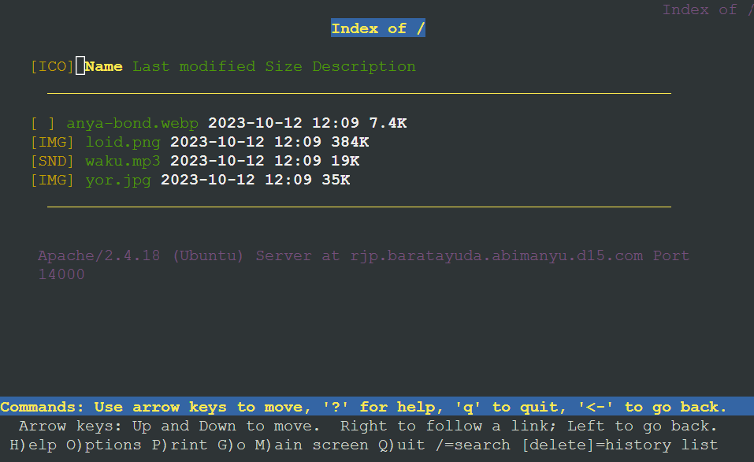

# **Lapres Praktikum Jarkom Modul 2 Kelompok D15**

### **Anggota Kelompok**

| **Nama**                  | **NRP**    |
| ------------------------- | ---------- |
| Rayhan Arvianta Bayuputra | 5025211217 |
| Yehezkiel Wiradhika       | 5025201086 |

## Daftar Isi

1. [Soal](#Soal)
2. [Setup-Topologi](#Setup-Topologi)
3. [Setup-DNS](#Setup-DNS)
4. [Setup-WebServer](#Setup-WebServer)
5. [Setting-WebServer](#Setting-WebServer)
6. [Bash-Scripts](#Bash-Scripts)

## Soal

1. Yudhistira akan digunakan sebagai DNS Master, Werkudara sebagai DNS Slave, Arjuna merupakan Load Balancer yang terdiri dari beberapa Web Server yaitu Prabakusuma, Abimanyu, dan Wisanggeni. Buatlah topologi dengan pembagian sebagai berikut. Folder topologi dapat diakses pada drive berikut
2. Buatlah website utama pada node arjuna dengan akses ke **arjuna.yyy.com** dengan alias **www.arjuna.yyy.com** dengan yyy merupakan kode kelompok.
3. Dengan cara yang sama seperti soal nomor 2, buatlah website utama dengan akses ke **abimanyu.yyy.com** dan alias **www.abimanyu.yyy.com**.
4. Kemudian, karena terdapat beberapa web yang harus di-deploy, buatlah subdomain **parikesit.abimanyu.yyy.com** yang diatur DNS-nya di Yudhistira dan mengarah ke Abimanyu.
5. Buat juga reverse domain untuk domain utama. (_Abimanyu saja yang direverse_)
6. Agar dapat tetap dihubungi ketika DNS Server Yudhistira bermasalah, buat juga Werkudara sebagai DNS Slave untuk domain utama.
7. Seperti yang kita tahu karena banyak sekali informasi yang harus diterima, buatlah subdomain khusus untuk perang yaitu **baratayuda.abimanyu.yyy.com** dengan alias **www.baratayuda.abimanyu.yyy.com** yang didelegasikan dari Yudhistira ke Werkudara dengan IP menuju ke Abimanyu dalam folder Baratayuda.
8. Untuk informasi yang lebih spesifik mengenai Ranjapan Baratayuda, buatlah subdomain melalui Werkudara dengan akses **rjp.baratayuda.abimanyu.yyy.com** dengan alias **www.rjp.baratayuda.abimanyu.yyy.com** yang mengarah ke Abimanyu.
9. Arjuna merupakan suatu Load Balancer Nginx dengan tiga worker (yang juga menggunakan nginx sebagai webserver) yaitu Prabakusuma, Abimanyu, dan Wisanggeni. Lakukan deployment pada masing-masing worker.
10. Kemudian gunakan algoritma **Round Robin** untuk Load Balancer pada **Arjuna**. Gunakan _server_name_ pada soal nomor 1. Untuk melakukan pengecekan akses alamat web tersebut kemudian pastikan worker yang digunakan untuk menangani permintaan akan berganti ganti secara acak. Untuk webserver di masing-masing worker wajib berjalan di port 8001-8003. Contoh
    - _Prabakusuma:8001_
    - _Abimanyu:8002_
    - _Wisanggeni:8003_
11. Selain menggunakan Nginx, lakukan konfigurasi Apache Web Server pada worker Abimanyu dengan web server **www.abimanyu.yyy.com**. Pertama dibutuhkan web server dengan DocumentRoot pada /var/www/abimanyu.yyy
12. Setelah itu ubahlah agar url **www.abimanyu.yyy.com/index.php/home** menjadi **www.abimanyu.yyy.com/home**.
13. Selain itu, pada subdomain **www.parikesit.abimanyu.yyy.com**, DocumentRoot disimpan pada /var/www/parikesit.abimanyu.yyy
14. Pada subdomain tersebut folder /public hanya dapat melakukan _directory listing_ sedangkan pada folder /secret tidak dapat diakses (_403 Forbidden_).
15. Buatlah kustomisasi halaman error pada folder /error untuk mengganti error kode pada Apache. Error kode yang perlu diganti adalah 404 Not Found dan 403 Forbidden.
16. Buatlah suatu konfigurasi virtual host agar file asset **www.parikesit.abimanyu.yyy.com/public/js** menjadi **www.parikesit.abimanyu.yyy.com/js**
17. Agar aman, buatlah konfigurasi agar **www.rjp.baratayuda.abimanyu.yyy.com** hanya dapat diakses melalui port 14000 dan 14400.
18. Untuk mengaksesnya buatlah autentikasi username berupa “Wayang” dan password “baratayudayyy” dengan yyy merupakan kode kelompok. Letakkan DocumentRoot pada /var/www/rjp.baratayuda.abimanyu.yyy.
19. Buatlah agar setiap kali mengakses IP dari Abimanyu akan secara otomatis dialihkan ke **www.abimanyu.yyy.com (alias)**
20. Karena website **www.parikesit.abimanyu.yyy.com** semakin banyak pengunjung dan banyak gambar gambar random, maka ubahlah request gambar yang memiliki substring “abimanyu” akan diarahkan menuju abimanyu.png.

PS:

- **yyy** pada url adalah **kode kelompok anda**
- File requirement dapat diakses melalui drive berikut.

## Setup-Topologi

Topologi dibuat sesuai dengan ketentuan soal, dimana `NAT1` terhubung ke `Router`, yang kemudian terhubung dengan dua buah switch yang masing-masing terhubung ke beberapa node. `Switch1` terhubung ke `NakulaClient`, `SadewaClient`, `AbimanyuWebServer`, `PrabakusumaWebServer`, dan `WisanggeniWebServer`. Sedangkan `Switch2` terhubung ke `YudhistiraDNSMaster`, `WerkudaraDNSSlave` dan `ArjunaLoadBalancer`.

> _Jawaban Soal 1_


Berikut adalah list IP dari setiap node pada topologi di atas

```sh
NakulaClient = 10.29.1.2
SadewaClient = 10.29.1.3
AbimanyuWebServer = 10.29.1.4
PrabukusumaWebServer = 10.29.1.5
WisanggeniWebServer = 10.29.1.6

YudhistiraDNSMaster = 10.29.2.2
WerkudaraDNSSlave = 10.29.2.3
ArjunaLoadBalancer = 10.29.2.4
```

## Setup-DNS

DNS akan disetup di YudhistiraDNSMaster serta WerkudaraDNSSlave. Requirements dari soal adalah sebagai berikut:

- Buatlah website utama pada node arjuna dengan akses ke arjuna.yyy.com dengan alias www.arjuna.yyy.com dengan yyy merupakan kode kelompok <span style="color:orange; font-weight:bold;">(soal 2)</span>
- Buatlah website utama dengan akses ke abimanyu.yyy.com dan alias www.abimanyu.yyy.com <span style="color:orange; font-weight:bold;">(soal 3)</span>
- Buatlah subdomain parikesit.abimanyu.yyy.com yang diatur DNS-nya di Yudhistira dan mengarah ke Abimanyu <span style="color:orange; font-weight:bold;">(soal 4)</span>
- Buat juga reverse domain untuk domain utama <span style="color:orange; font-weight:bold;">(soal 5)</span>
- Buat juga Werkudara sebagai DNS Slave untuk domain utama <span style="color:orange; font-weight:bold;">(soal 6)</span>
- Buatlah subdomain khusus untuk perang yaitu baratayuda.abimanyu.yyy.com dengan alias www.baratayuda.abimanyu.yyy.com yang didelegasikan dari Yudhistira ke Werkudara dengan IP menuju ke Abimanyu dalam folder Baratayuda <span style="color:orange; font-weight:bold;">(soal 7)</span>
- Buatlah subdomain melalui Werkudara dengan akses rjp.baratayuda.abimanyu.yyy.com dengan alias www.rjp.baratayuda.abimanyu.yyy.com yang mengarah ke Abimanyu <span style="color:orange; font-weight:bold;">(soal 8)</span>

Dengan ketentuan-ketentuan tersebut, maka pertama kita harus setting DNS di Yudhistira sebagai DNS Master.

### Setting DNS Master

> _named.conf.local_ Yudhistira


```bind
//
// Do any local configuration here
//

// Consider adding the 1918 zones here, if they are not used in your
// organization
//include "/etc/bind/zones.rfc1918";

// main arjuna
zone "arjuna.d15.com" {
        type master;
        notify yes;
        also-notify { 10.29.2.3; };  // IP Werkudara sebagai slave
        allow-transfer { 10.29.2.3; };  // IP Werkudara sebagai slave
        file "/etc/bind/arjuna/arjuna.d15.com";
};

// main abimanyu
zone "abimanyu.d15.com" {
        type master;
        notify yes;
        also-notify { 10.29.2.3; };  // IP Werkudara sebagai slave
        allow-transfer { 10.29.2.3; };  // IP Werkudara sebagai slave
        file "/etc/bind/abimanyu/abimanyu.d15.com";
};

zone "baratayuda.abimanyu.d15.com" {
    type master;
    file "/etc/bind/delegasi/baratayuda.abimanyu.d15.com";
    allow-transfer { 10.29.2.3; };  // IP address of the slave server
};

// reverse abimanyu
zone "1.29.10.in-addr.arpa" {
    type master;
    notify yes;
    also-notify { 10.29.2.3; };  // IP Werkudara sebagai slave
    allow-transfer { 10.29.2.3; };  // IP Werkudara sebagai slave
    file "/etc/bind/abimanyu/1.29.10.in-addr.arpa";
};
```

Pada BIND DNS server configuration file `named.conf.local`, telah kita setup beberapa DNS zone, meliputi:

1. `arjuna.d15.com` : zone DNS untuk domain **arjuna.d15.com**, diatur sebagai server master, dan memberi tahu server slave (Werkudara) saat ada pembaruan.
2. `abimanyu.d15.com` : zone DNS untuk domain **abimanyu.d15.com**, juga diatur sebagai server master, dan memberi tahu server slave (Werkudara) saat ada perubahan.
3. `baratayuda.abimanyu.d15.com` : zone DNS untuk subdomain **baratayuda.abimanyu.d15.com**, diatur sebagai server master, dan data zona untuk subdomain tersebut disimpan dalam file.
   - <span style="color:gray; font-style:italic;"> note: untuk zone ini merupakan solusi mepet karena apabila tidak ada deklarasi zone ini, subdomain baratayuda tidak terbaca sebagai delegasi subdomain ke werkudara. (sangat bukan best practice)</span>
4. `1.29.10.in-addr.arpa` : zone DNS reverse untuk rentang alamat IP 10.29.1.0/24 yang digunakan oleh domain abimanyu.d15.com, juga diatur sebagai server master, dan memberi tahu server slave (Werkudara) saat ada perubahan.

Setelah itu untuk zone BIND file dari setiap zone adalah sebagai berikut.

> _Arjuna Zone_


```bind
;
; BIND data file for local loopback interface
;
$TTL    604800
@       IN      SOA     arjuna.d15.com. root.arjuna.d15.com. (
                              2         ; Serial
                         604800         ; Refresh
                          86400         ; Retry
                        2419200         ; Expire
                         604800 )       ; Negative Cache TTL
;
@       IN      NS      arjuna.d15.com.
@       IN      A       10.29.2.4       ; IP Arjuna
www     IN      CNAME   arjuna.d15.com.
@       IN      AAAA    ::1
```

Pada baris pertama, **NS (Name Server)** menunjukkan bahwa server otoritatif untuk zona ini adalah `arjuna.d15.com`. Kemudian, catatan **A (Address)** menghubungkan nama **@ (root domain)** dengan alamat IP `10.29.2.4`, mungkin merujuk ke server DNS ini. Selain itu, ada catatan **CNAME** yang mengaitkan `www dengan arjuna.d15.com`, sehingga saat mengakses `www.arjuna.d15.com`, itu merujuk ke `arjuna.d15.com`.

> _Abimanyu Zone_


```bind
;
; BIND data file for local loopback interface
;
$TTL    604800
@       IN      SOA     abimanyu.d15.com. root.abimanyu.d15.com. (
                              2         ; Serial
                         604800         ; Refresh
                          86400         ; Retry
                        2419200         ; Expire
                         604800 )       ; Negative Cache TTL
;
@       IN      NS      abimanyu.d15.com.
@       IN      A       10.29.1.4       ; IP Abimanyu
www     IN      CNAME   abimanyu.d15.com.
parikesit       IN      A       10.29.1.4       ; IP Abimanyu
www.parikesit   IN      CNAME   parikesit.abimanyu.d15.com.
ns1     IN      A       10.29.2.3       ; IP Werkudara
baratayuda      IN      NS      ns1
@       IN      AAAA    ::1
```

Deklarasi **NS (Name Server)** menunjukkan bahwa server otoritatif untuk zona ini adalah `abimanyu.d15.com`. Catatan **A (Address)** mengaitkan nama **@ (root domain)** dengan alamat IP **10.29.1.4**, yang mungkin merujuk ke server DNS ini. Selain itu, ada catatan **CNAME** yang mengaitkan www dengan `abimanyu.d15.com`, sehingga saat mengakses `www.abimanyu.d15.com`, itu merujuk ke `abimanyu.d15.com`. Terdapat juga catatan **A** lainnya untuk **subdomain parikesit** yang mengarahkan ke alamat IP yang sama dengan `abimanyu.d15.com`. Kemudian, catatan **CNAME** untuk `www.parikesit` menghubungkan subdomain tersebut dengan `parikesit.abimanyu.d15.com`. Selanjutnya, ada delegasi subdomain `baratayuda.abimanyu.d15.com` dengan catatan NS yang mengarahkan ke server `ns1 (Werkudara)`. Ini memungkinkan subdomain `baratayuda` untuk dikelola oleh server DNS yang berbeda, dalam hal ini, server ns1. Ada juga catatan AAAA yang menghubungkan nama **@** dengan alamat **IPv6 loopback ::1**.

> _Reverse Abimanyu Zone_


```bind
;
; BIND data file for local loopback interface
;
$TTL    604800
@       IN      SOA     abimanyu.d15.com. root.abimanyu.d15.com. (
                              2         ; Serial
                         604800         ; Refresh
                          86400         ; Retry
                        2419200         ; Expire
                         604800 )       ; Negative Cache TTL
;
1.29.10.in-addr.arpa.   IN      NS      abimanyu.d15.com.
4                       IN      PTR     abimanyu.d15.com. ; Byte ke-4 Abimanyu
```

Deklarasi NS (Name Server) menghubungkan zona reverse ini ke server `abimanyu.d15.com`. Selanjutnya, ada catatan **PTR** (Pointer) yang menghubungkan alamat IP `10.29.1.4` dengan nama domain `abimanyu.d15.com`.

Supaya delegasi subdomain `baratayuda.abimanyu.d15.com` dapat bekerja, kita harus ubah sedikit setting pada `named.conf.options`


```bind
options {
        directory "/var/cache/bind";

        // If there is a firewall between you and nameservers you want
        // to talk to, you may need to fix the firewall to allow multiple
        // ports to talk.  See http://www.kb.cert.org/vuls/id/800113

        // If your ISP provided one or more IP addresses for stable
        // nameservers, you probably want to use them as forwarders.
        // Uncomment the following block, and insert the addresses replacing
        // the all-0's placeholder.

        forwarders {
               192.168.122.1; // IP ns Router
        };

        //========================================================================
        // If BIND logs error messages about the root key being expired,
        // you will need to update your keys.  See https://www.isc.org/bind-keys
        //========================================================================
        //dnssec-validation auto;
        allow-query{any;};

        auth-nxdomain no;    # conform to RFC1035
        listen-on-v6 { any; };
};
```

Menambahkan `allow-query{any;};` memungkinkan server DNS menerima berbagai jenis permintaan DNS, termasuk permintaan yang terkait dengan delegasi subdomain, yang memungkinkan aliran informasi delegasi. Selain itu juga diterapkan IP forwarding ke router supaya client dapat mengakses internet cukup dengan nameserver Master.

### Setting DNS Slave

> _named.conf.local_ Werkudara


```bind
//
// Do any local configuration here
//

// Consider adding the 1918 zones here, if they are not used in your
// organization
//include "/etc/bind/zones.rfc1918";

zone "arjuna.d15.com" {
    type slave;
    masters { 10.29.2.2; }; // IP Yudhistira sebagai Master
    file "var/lib/bind/arjuna/arjuna.d15.com";
};

zone "abimanyu.d15.com" {
    type slave;
    masters { 10.29.2.2; }; // IP Yudhistira sebagai Master
    file "var/lib/bind/abimanyu/abimanyu.d15.com";
};

zone "1.29.10.in-addr.arpa" {
    type slave;
    masters { 10.29.2.2; };  // IP Yudhistira sebagai Master
    file "/etc/lib/bind/abimanyu/1.29.10.in-addr.arpa";
};

zone "baratayuda.abimanyu.d15.com" {
    type master;
    file "/etc/bind/delegasi/baratayuda.abimanyu.d15.com";
};
```

Pada konfigurasi ini, terdapat beberapa zona dalam server DNS.

- Zone `"arjuna.d15.com"` dan `"abimanyu.d15.com"` ditentukan sebagai **zone slave** yang mengikuti server master (Yudhistira) dengan tujuan untuk menyimpan salinan data zone master.
- Zone `"1.29.10.in-addr.arpa"` juga merupakan **zone slave** yang mengikuti server master untuk **resolusi reverse DNS**.
- Zone `"baratayuda.abimanyu.d15.com"` ditentukan sebagai zone master, yang berarti server DNS ini adalah otoritatif untuk zone ini dan bertanggung jawab untuk delegasi subdomain `"baratayuda.abimanyu.d15.com"`.

Setelah itu untuk zone BIND file dari zona delegasi baratayuda adalah sebagai berikut.

> _Delegasi Baratayuda Zone_


```bind
;
; BIND data file for local loopback interface
;
$TTL    604800
@       IN      SOA     baratayuda.abimanyu.d15.com. root.baratayuda.abimanyu.d15.com. (
                              2         ; Serial
                         604800         ; Refresh
                          86400         ; Retry
                        2419200         ; Expire
                         604800 )       ; Negative Cache TTL
;
@       IN      NS      baratayuda.abimanyu.d15.com.
@       IN      A       10.29.1.4       ; IP Abimanyu (baratayuda)
www     IN      CNAME   @               ; IP Abimanyu (baratayuda)
rjp     IN      A       10.29.1.4       ; IP Abimanyu (rjp baratayuda)
www.rjp IN      CNAME   rjp.baratayuda.abimanyu.d15.com. ; IP Abimanyu (rjp baratayuda)
```

Deklarasi **NS (Name Server)** menghubungkan zone ini ke server otoritatif, yaitu `baratayuda.abimanyu.d15.com.` yang menunjuk ke alamat IP `10.29.1.4`. Selanjutnya, catatan **A** mengaitkan alamat IP `10.29.1.4` dengan nama domain `baratayuda.abimanyu.d15.com`. Kemudian, ada catatan **CNAME** yang menciptakan alias `www` untuk merujuk ke zone `baratayuda.abimanyu.d15.com` dan `rjp` yang mengarahkan alamat IP `10.29.1.4`. Terakhir, catatan **CNAME** lainnya mengaitkan alias `www.rjp` dengan subdomain `rjp.baratayuda.abimanyu.d15.com` dalam zone `baratayuda.abimanyu.d15.com`.

Supaya delegasi subdomain `baratayuda.abimanyu.d15.com` dapat bekerja, kita harus ubah sedikit setting pada `named.conf.options`


```bind
options {
        directory "/var/cache/bind";

        // If there is a firewall between you and nameservers you want
        // to talk to, you may need to fix the firewall to allow multiple
        // ports to talk.  See http://www.kb.cert.org/vuls/id/800113

        // If your ISP provided one or more IP addresses for stable
        // nameservers, you probably want to use them as forwarders.
        // Uncomment the following block, and insert the addresses replacing
        // the all-0's placeholder.

        // forwarders {
        //      0.0.0.0;
        // };

        //========================================================================
        // If BIND logs error messages about the root key being expired,
        // you will need to update your keys.  See https://www.isc.org/bind-keys
        //========================================================================
        //dnssec-validation auto;
        allow-query{any;};

        auth-nxdomain no;    # conform to RFC1035
        listen-on-v6 { any; };
};
```

Setting pada file ini sama dengan master, hanya saja tidak diterapkan IP forwarding ke router untuk internet disini.

Supaya semua ini berjalan secara otomatis pada saat node dinyalakan serta progress tidak hilang, dilakukan langkah-langkah berikut

- Copy folder bind ke root dengan command `cp -rf /etc/bind /root/dns`
- Buat script untuk menginstall dependecies dan command yang dibutuhkan untuk bind9

```sh
apt-get update
apt-get install bind9 -y
cp -r -f /root/dns/bind /etc/
service bind9 restart
```

- Panggil script melalui **/root/.bashrc**

Berikut adalah hasil testing dari NakulaClient


## Setup-WebServer

Web server akan disetup di ArjunaLoadBalancer, AbimanyuWebServer, PrabakusumaWebServer, dan WisanggeniWebServer. Requirements dari soal adalah sebagai berikut:

- Arjuna merupakan suatu Load Balancer Nginx dengan tiga worker (yang juga menggunakan nginx sebagai webserver) yaitu Prabakusuma, Abimanyu, dan Wisanggeni. <span style="color:orange; font-weight:bold;">(soal 9)</span>
- Gunakan algoritma Round Robin untuk Load Balancer pada Arjuna. Gunakan server_name pada soal nomor 1. Untuk webserver di masing-masing worker wajib berjalan di port 8001-8003. Contoh: <span style="color:orange; font-weight:bold;">(soal 10)</span>
  - _Prabakusuma:8001_
  - _Abimanyu:8002_
  - _Wisanggeni:8003_

Pertama-tama kita harus setup Load Balancer nginx pada node Arjuna, yang menerapkan algoritma **Round Robbin** dalam load balancingnya.

### Setting Load Balancer


```nginx
# Round Robin
upstream myweb  {
        server 10.29.1.5:8001; #IP Abimanyu
        server 10.29.1.4:8002; #IP Prabakusuma
        server 10.29.1.6:8003; #IP Wisanggeni
}

 server {
        listen 80;
        server_name arjuna.d15.com;

        location / {
        proxy_pass http://myweb;
        }
}
```

- `upstream` - mendefinisikan grup atau kelompok server yang akan menerima lalu lintas atau beban dengan myweb sebagai nama upstream. Dalam kasus ini, ada dua server dengan alamat IP masing-masing server 10.29.1.5:8001, server 10.29.1.4:8002 dan server 10.29.1.6:8003. Dengan metode Round Robin, lalu lintas akan dibagi secara setara antara kedua server ini.
- `listen` - mendefinisikan bahwa web server ini akan berjalan dan mendengarkan permintaan (request) pada port 80.
- `location / { ... }` mengatur cara server Nginx menangani permintaan. Dalam hal ini, semua permintaan akan diteruskan ke grup server yang telah didefinisikan di bagian upstream.

Setelah mengimplementasi setting tersebut, jangan lupa untuk buat symlink dengan `ln -s /etc/nginx/sites-available/lb-arjuna /etc/nginx/sites-enabled` dan restart nginx dengan `service nginx restart`.

### Setting Worker

Setelah load balancer telah di setting, kita akan setting nginx dari setiap worker.

#### Abimanyu

Pada server abimanyu, akan dibuat file pada direktori `sites-available` bernama `arjuna` dengan konfigurasi sebagai berikut.


```nginx
server {

        listen 8002;

        root /var/www/arjuna.d15.com;

        index index.php;
        server_name _;

        location / {
                        try_files $uri $uri/ /index.php?$query_string;
        }

        # pass PHP scripts to FastCGI server
        location ~ \.php$ {
        include snippets/fastcgi-php.conf;
        fastcgi_pass unix:/var/run/php/php7.0-fpm.sock;
        }

location ~ /\.ht {
                        deny all;
        }

        error_log /var/log/nginx/jarkom_error.log;
        access_log /var/log/nginx/jarkom_access.log;
}
```

Di dalam konfigurasi tersebut server nginx akan berjalan di port `8002`.

- Menunjuk ke direktori root di `/var/www/arjuna.d15.com`.
- Menggunakan `index.php` sebagai file indeks.
- Menggunakan placeholder `server_name _;` untuk menangani semua permintaan yang masuk.
- Menggunakan blok location / untuk mengkonfigurasi rute dasar, mencoba menemukan file yang cocok atau mengarahkan ke index.php dengan query string jika tidak ada.
- Menggunakan blok location ~ \.php$ untuk mengirim permintaan PHP ke server FastCGI.
- Mengabaikan file .htaccess dengan blok location ~ /\.ht dan melarang akses ke file tersebut.
- Merekam error log ke /var/log/nginx/jarkom_error.log.
- Merekam access log ke /var/log/nginx/jarkom_access.log.

Setelah mengimplementasi hal tersebut, symlink harus dibuat dengan `ln -s /etc/nginx/sites-available/arjuna /etc/nginx/sites-enabled` kemudian restart nginx dengan `service nginx restart`. Karena abimanyu juga akan menjankan apache2 untuk web abimanyu, maka file default harus dihapus dari sites-enabled karena portnya akan bertabrakan dengan port apache2 (80). `rm -rf /etc/nginx/sites-enabled/default`

Setelah mengkonfigurasi nginx, kita harus mendownload file index.php dari link drive yang telah dibagi di soal. Langkah-langkahnya adalah sebagai berikut

- Download file menggunakan wget command berikut

```bash
wget --load-cookies /tmp/cookies.txt "https://docs.google.com/uc?export=download&confirm=$(wget --quiet --save-cookies /tmp/cookies.txt --keep-session-cookies --no-check-certificate 'https://docs.google.com/uc?export=download&id=17tAM_XDKYWDvF-JJix1x7txvTBEax7vX' -O- | sed -rn 's/.*confirm=([0-9A-Za-z_]+).*/\1\n/p')&id=17tAM_XDKYWDvF-JJix1x7txvTBEax7vX" -O arjuna.zip && rm -rf /tmp/cookies.txt
```

- Unzip file dengan output nama folder `arjuna.d15.com`.

#### Prabakusuma dan Wisanggeni

Konfigurasi nginx pada Prabakusuma dan Wisanggeni akan sama dengan yang di Abimanyu. Hanya saja tidak perlu menghapus file default dari sites-enabled karena tidak menjalankan apache2.

> Konfigurasi nginx Prabakusuma


```nginx
server {

        listen 8001;

        root /var/www/arjuna.d15.com;

        index index.php;
        server_name _;

        location / {
                        try_files $uri $uri/ /index.php?$query_string;
        }

        # pass PHP scripts to FastCGI server
        location ~ \.php$ {
        include snippets/fastcgi-php.conf;
        fastcgi_pass unix:/var/run/php/php7.0-fpm.sock;
        }

location ~ /\.ht {
                        deny all;
        }

        error_log /var/log/nginx/jarkom_error.log;
        access_log /var/log/nginx/jarkom_access.log;
}
```

> Konfigurasi nginx Wisanggeni


```nginx
server {

        listen 8003;

        root /var/www/arjuna.d15.com;

        index index.php;
        server_name _;

        location / {
                        try_files $uri $uri/ /index.php?$query_string;
        }

        # pass PHP scripts to FastCGI server
        location ~ \.php$ {
        include snippets/fastcgi-php.conf;
        fastcgi_pass unix:/var/run/php/php7.0-fpm.sock;
        }

location ~ /\.ht {
                        deny all;
        }

        error_log /var/log/nginx/jarkom_error.log;
        access_log /var/log/nginx/jarkom_access.log;
}
```

Berikut adalah hasil testing dengan `lynx.arjuna.d15.com`


Apabila dispam lynxnya, server tujuan akan berubah-ubah. Jika ingin testing keberhasilan dapat mematikan nginx pada semua worker server selain server tujuan yang ingin ditest.

## Setting-WebServer

Webserver akan disetup di AbimanyuWebServer. Requirements dari soal adalah sebagai berikut:

- Selain menggunakan Nginx, lakukan konfigurasi Apache Web Server pada worker Abimanyu dengan web server www.abimanyu.yyy.com. Pertama dibutuhkan web server dengan DocumentRoot pada /var/www/abimanyu.yyy <span style="color:orange; font-weight:bold;">(soal 11)</span>
- Setelah itu ubahlah agar url www.abimanyu.yyy.com/index.php/home menjadi www.abimanyu.yyy.com/home. <span style="color:orange; font-weight:bold;">(soal 12)</span>
- Selain itu, pada subdomain www.parikesit.abimanyu.yyy.com, DocumentRoot disimpan pada /var/www/parikesit.abimanyu.yyy <span style="color:orange; font-weight:bold;">(soal 13)</span>
- Pada subdomain tersebut folder /public hanya dapat melakukan directory listing sedangkan pada folder /secret tidak dapat diakses (403 Forbidden). <span style="color:orange; font-weight:bold;">(soal 14)</span>
- Buatlah kustomisasi halaman error pada folder /error untuk mengganti error kode pada Apache. Error kode yang perlu diganti adalah 404 Not Found dan 403 Forbidden. <span style="color:orange; font-weight:bold;">(soal 15)</span>
- Buatlah suatu konfigurasi virtual host agar file asset www.parikesit.abimanyu.yyy.com/public/js menjadi www.parikesit.abimanyu.yyy.com/js <span style="color:orange; font-weight:bold;">(soal 16)</span>
- Agar aman, buatlah konfigurasi agar www.rjp.baratayuda.abimanyu.yyy.com hanya dapat diakses melalui port 14000 dan 14400. <span style="color:orange; font-weight:bold;">(soal 17)</span>
- Untuk mengaksesnya buatlah autentikasi username berupa “Wayang” dan password “baratayudayyy” dengan yyy merupakan kode kelompok. Letakkan DocumentRoot pada /var/www/rjp.baratayuda.abimanyu.yyy. <span style="color:orange; font-weight:bold;">(soal 18)</span>
- Buatlah agar setiap kali mengakses IP dari Abimanyu akan secara otomatis dialihkan ke www.abimanyu.yyy.com (alias) <span style="color:orange; font-weight:bold;">(soal 19)</span>
- Karena website www.parikesit.abimanyu.yyy.com semakin banyak pengunjung dan banyak gambar gambar random, maka ubahlah request gambar yang memiliki substring “abimanyu” akan diarahkan menuju abimanyu.png. <span style="color:orange; font-weight:bold;">(soal 20)</span>

> _Instalasi Apache2 dan PHP_

install apache2 di web server abimanyu

```
$ apt-get update && apt-get install apache2 -y
```

tidak lupa install juga PHP

```
$ apt-get install php libapache2-mod-php7.0 -y
```

Setelah itu untuk konfigurasi web server dari setiap FQDN adalah sebagai berikut.

> _abimanyu.d15.com_

buat file pada lokasi <code>/etc/apache2/sites-available/abimanyu.d15.conf</code> lalu isi sebagai berikut:

```
<VirtualHost *:80>

   ServerName abimanyu.d15.com
   ServerAlias www.abimanyu.d15.com
   ServerAdmin webmaster@localhost
   DocumentRoot /var/www/abimanyu.d15

</VirtualHost>
```

Setelah itu, kita enable script tersebut dengan command sebagai berikut

```
$ a2ensite /etc/apache2/sites-available/abimanyu.d15.conf
```

Setelah itu kita mengubah agar url www.abimanyu.yyy.com/index.php/home menjadi www.abimanyu.yyy.com/home.

kita tambahkan sebagai berikut di <code>/etc/apache2/sites-available/abimanyu.d15.conf</code>

```
<Directory /var/www/abimanyu.d15>
   Options +FollowSymLinks -Multiviews
   AllowOverride All
</Directory>
```

kita juga menambahkan kode berikut di <code>/var/www/abimanyu.d15/.htaccess</code>

```
RewriteEngine On
RewriteCond ${REQUEST_FILENAME} !-d
RewriteRule ^([^\.]+)$ $1.html [NC,L]
```

kode di atas akan menghilangkan <code>\*.html</code> dari semua request, sehingga kita bisa melakukan request ke <code>http://abimanyu.d15.com/home</code> karena index page terdapat pada file dengan lokasi <code>/var/www/abimanyu.d15/home.html</code>

tidak lupa kita melakukan enable modul rewrite sehingga code diatas dapat berfungsi dengan command sebagai berikut

```
$ a2enmod rewrite
```

agar setiap kali mengakses IP dari Abimanyu akan secara otomatis dialihkan ke www.abimanyu.yyy.com, kita menambahkan code berikut di 000-default.conf

```
<VirtualHost *:80>

   ServerName 10.29.1.4
   Redirect permanent / http://www.abimanyu.d15.com/
   ServerAdmin webmaster@localhost
   DocumentRoot /var/www/abimanyu.d15.com

</VirtualHost>
```

restart apache2

```
$ service apache2 restart
```

> _parikesit.abimanyu.d15.com_

buat file pada lokasi <code>/etc/apache2/sites-available/parikesit.abimanyu.d15.conf</code> lalu isi sebagai berikut:

```
<VirtualHost *:80>

   ServerName parikesit.abimanyu.d15.com
   ServerAlias www.parikesit.abimanyu.d15.com
   ServerAdmin webmaster@localhost
   DocumentRoot /var/www/parikesit.abimanyu.d15

</VirtualHost>
```

Setelah itu, kita enable script tersebut dengan command sebagai berikut

```
$ a2ensite /etc/apache2/sites-available/parikesit.abimanyu.d15.conf
```

Kemudian, kita membuat sehingga pada subdomain tersebut folder /public hanya dapat melakukan directory listing sedangkan pada folder /secret tidak dapat diakses (403 Forbidden) dengan menambahkan script sebagai berikut di <code>/etc/apache2/sites-available/parikesit.abimanyu.d15.conf</code>

```
<Directory /var/www/parikesit.abimanyu.d15/public>
        Options +Indexes
</Directory>

<Directory /var/www/parikesit.abimanyu.d15/secret>
        Options -Indexes
</Directory>
```

Untuk melakukan kustomisasi halaman error pada folder /error untuk mengganti error kode pada Apache. Error kode yang perlu diganti adalah 404 Not Found dan 403 Forbidden, kita perlu menambahkan script berikut di <code>/etc/apache2/sites-available/parikesit.abimanyu.d15.conf</code>

```
ErrorDocument 404 /error/404.html
ErrorDocument 403 /error/403.html
```

agar file asset <code>www.parikesit.abimanyu.yyy.com/public/js</code> menjadi
<code>www.parikesit.abimanyu.yyy.com/js</code>, kita bisa menambahkan code berikut di <code>/etc/apache2/sites-available/parikesit.abimanyu.d15.conf</code>

```
Alias "/js" "/var/www/parikesit.abimanyu.d15.com/public/js"
```

Karena website www.parikesit.abimanyu.yyy.com semakin banyak pengunjung dan banyak gambar gambar random, maka ubahlah request gambar yang memiliki substring “abimanyu” akan diarahkan menuju abimanyu.png. Untuk melakukan hal tersebut, kita perlu menambahkan kode berikut di <code>/etc/apache2/sites-available/parikesit.abimanyu.d15.conf</code>

```
RewriteEngine On
RewriteCond ${REQUEST_URI} abimanyu
RewriteRule \.(jpg|jpeg|png|gif)$ /public/images/abimanyu.png [L]
```

agar script di atas dapat dijalankan, kita perlu mengaktifkan modul rewrite dengan command sebagai berikut

```
$ a2enmod rewrite
```

restart apache2

```
$ service apache2 restart
```

> _rjp.baratayuda.abimanyu.d15.com_

untuk membuat konfigurasi agar www.rjp.baratayuda.abimanyu.yyy.com hanya dapat diakses melalui port 14000 dan 14400, kita perlu membuat script sebagai berikut di <code>/etc/apache2/sites-available/rjp.baratayuda.abimanyu.d15.com</code>

```
<VirtualHost *:14000 *:14400>

   ServerName rjp.baratayuda.abimanyu.d15.com
   ServerAlias www.rjp.baratayuda.abimanyu.d15.com
   ServerAdmin webmaster@localhost
   DocumentRoot /var/www/rjp.baratayuda.abimanyu.d15

   <Directory /var/www/rjp.baratayuda.abimanyu.d15.com>
        AuthType Basic
        AuthName "Restricted Area"
        AuthUserFile /etc/apache2/.htpasswd
        Require valid-user
   </Directory>

</VirtualHost>
```

Setelah itu, kita enable script tersebut dengan command sebagai berikut

```
$ a2ensite /etc/apache2/sites-available/rjp.baratayuda.abimanyu.d15.conf
```

setelah itu, kita perlu membuat file <code>/etc/apache2/.htpasswd</code> sebagai tempat setting password dan username dengan command sebagai berikut

```
$ htpasswd -bc /etc/apache2/.htpasswd Wayang baratayudad15
```

kemudian kita enable modul-modul yang dibutuhkan agar bisa melakukan login menggunakan username dan password dengan command sebagai berikut

```
$ a2enmod authn_core authz_core authn_file authz_user
```

restart apache2

```
$ service apache2 restart
```

> _Testing_

untuk melakukan pengecheckan, kita pergi ke NakulaClient dan menginstall lynx

```
$ apt-get update && apt-get install lynx -y
```

11. www.abimanyu.d15.com

```
$ lynx www.abimanyu.d15.com
```

Hasil:


12. www.abimanyu.yyy.com/home

```
$ lynx www.abimanyu.d15.com/home
```

Hasil:


13. www.parikesit.abimanyu.yyy.com

```
$ lynx www.parikesit.abimanyu.yyy.com
```

Hasil:


14. folder /public hanya dapat melakukan directory listing sedangkan pada folder /secret tidak dapat diakses (403 Forbidden)

```
$ lynx parikesit.abimanyu.d15.com/secret
```

Hasil:


15. Buatlah kustomisasi halaman error pada folder /error untuk mengganti error kode pada Apache. Error kode yang perlu diganti adalah 404 Not Found dan 403 Forbidden.

```
$ lynx parikesit.abimanyu.d15.com/secret
```

Hasil:


```
$ lynx parikesit.abimanyu.d15.com/testing
```

Hasil:


16. www.parikesit.abimanyu.yyy.com/public/js menjadi
    www.parikesit.abimanyu.yyy.com/js

```
$ lynx parikesit.abimanyu.d15.com/js
```

Hasil:


17. www.rjp.baratayuda.abimanyu.yyy.com hanya dapat diakses melalui port 14000 dan 14400.

```
$ lynx rjp.baratayuda.abimanyu.d15.com:14000
```

atau

```
$ lynx rjp.baratayuda.abimanyu.d15.com:14400
```

Hasil:


```
$ lynx rjp.baratayuda.abimanyu.d15.com:8900
```

Hasil:


18. buatlah autentikasi username berupa “Wayang” dan password “baratayudayyy” dengan yyy merupakan kode kelompok

```
$ lynx rjp.baratayuda.abimanyu.d15.com:14000
```

atau

```
$ lynx rjp.baratayuda.abimanyu.d15.com:14400
```

Hasil:




19. Buatlah agar setiap kali mengakses IP dari Abimanyu akan secara otomatis dialihkan ke www.abimanyu.yyy.com

```
$ lynx 10.29.1.4
```

Hasil:


20. Karena website www.parikesit.abimanyu.yyy.com semakin banyak pengunjung dan banyak gambar gambar random, maka ubahlah request gambar yang memiliki substring “abimanyu” akan diarahkan menuju abimanyu.png.

untuk mengecheck apakah gambar yang didownload adalah <code>abimanyu.png</code> kita install exiftool dengan command berikut pada NakulaClient

```
$ apt-get install exiftool -y
```

kita coba download gambar

```
$ lynx parikesit.abimanyu.d15.com/public/images/abimanyu.png
```

apabila dilihat berikut merupakan spesifikasi filennya:

```
$exiftool abimanyu.png
```


kita coba download file lain yang mengandung substring "abimanyu"

```
$ lynx parikesit.abimanyu.d15.com/public/images/not-abimanyu.png
```

apabila dilihat berikut merupakan spesifikasi filennya:

```
$exiftool abimanyu.png
```


di sini kita bisa lihat walaupun namanya berbeda, spesifikasinya persis sama yang berarti yang didownlnoad merupakan file abimanyu.png
